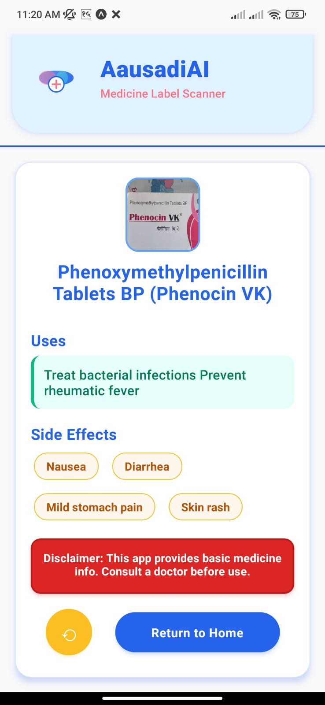
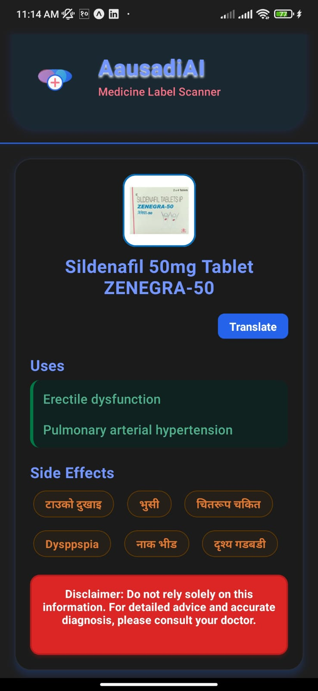
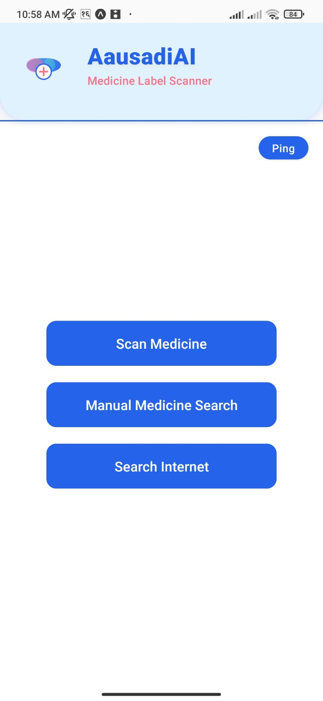

# Ausadhi AI

Ausadhi AI is a mobile application designed to help users quickly and easily identify medicines and get information about them. The project uses a powerful combination of Optical Character Recognition (OCR) and Natural Language Processing (NLP) to recognize and process medicine names from images.

## Background

The initial motivation for this project was to address the common problem of not having immediate access to information about a particular medicine. This application allows a user to simply take a photo of the medicine's packaging, and the app will provide details about its uses, side effects, and more. This can be particularly helpful for people who have difficulty reading small print or for those who want to quickly verify information about a drug.

## Features

*   **Medicine Identification from Image:** Snap a photo of a medicine's box or label, and the app will identify the drug and provide detailed information.
*   **Manual Search:** Manually type in the name of a medicine to search for its details.
*   **Detailed Information:** Get comprehensive information about medicines, including:
    *   Uses
    *   Side Effects
    *   Chemical Class
    *   Therapeutic Class
    *   Action Class
    *   Habit-Forming potential

## How It Works

The project is divided into two main components: a mobile client and a server backend.

### Client

The client is a React Native application built with Expo. It provides a user-friendly interface for capturing images of medicines or entering their names manually. It then sends requests to the server and displays the information received.

*   **Framework:** React Native with Expo
*   **Key Libraries:**
    *   `expo-camera` for accessing the device's camera.
    *   `expo-image-picker` for selecting images from the device's library.
    *   `axios` for communicating with the server.

### Server

The server is a Python application built with the FastAPI framework. It handles the core logic of the application, including image processing, text recognition, and information retrieval.

*   **Framework:** FastAPI
*   **OCR:** The server uses `easyocr` and `paddleocr` to extract text from the images of medicines.
*   **NLP:** A custom Named Entity Recognition (NER) model (`en_core_med7_lg`) is used with `spaCy` to identify drug names and other relevant entities from the extracted text.
*   **Information Retrieval:** For a given drug name, cosine similarity is used with `scikit-learn` to find the best match from a database of drug information. This data was likely compiled by scraping web sources like 1mg and NepMeds (as suggested by the `webscraper` directory).

## Project Structure

```
.
├── client/         # React Native mobile application
└── Server/         # Python FastAPI server
    ├── main.py     # Main server application
    ├── ocr.py      # OCR processing logic
    ├── nlp.py      # NLP and NER logic
    ├── webscraper/ # Scripts for scraping drug data
    └── Dataset/    # Medicine datasets
```

## Screenshots

<p align="center">
  
  
  
</p>
